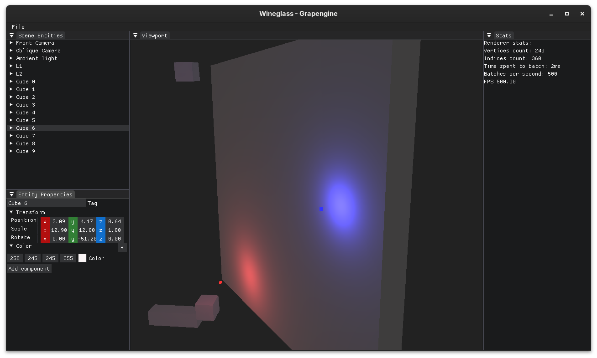

# Grapengine 🍇

A 3D Graphics Engine made with C++20 and OpenGL core profile.




### Configure

This project use `CMake`, `VCPKG` as package manager and a `CMakePresets.json` file.

The `VCPKG` is set up as git submodule.

Clone with:

```shell
## SSH
git clone --recursive git@github.com:viniciusalmada/Grapengine.git
## HTTPS
git clone --recursive https://github.com/viniciusalmada/Grapengine.git
```

There is also ImGui (https://github.com/ocornut/imgui.git) configured as submodule, it is being used to develop the
engine editor (**Wineglass 🍷**).

## Build

To build the project, only call `cmake` with the desired preset.

At this point there are 3 supported compilers and 2 differents platforms:

* For Microsoft Windows platform:
    * LLVM/Clang-cl (v16)
    * MSVC cl (2022)
* For any Linux distribution:
    * GNU GCC (v13)
    * LLVM/Clang (v16)

The list of presets are following:

* `msvc-debug`- Debug build with MSVC compiler
* `msvc-release`- Optimized build with MSVC compiler
* `clang-win-debug`- Debug build with Clang compiler as MSVC frontend
* `clang-win-release`- Optimized build with Clang compiler as MSVC frontend
* `clang-linux-debug`- Debug build with Clang compiler as GCC frontend
* `clang-linux-release`- Optimized build with Clang compiler as GCC frontend
* `gcc-debug`- Debug build with GCC compiler
* `gcc-release`- Optmized build with GCC compiler

Just call `cmake --preset <preset-name>`, this will create a folder `build-<preset-name>` with the necessary files to
compile the project.
After this, to build, call `cmake --build build-<preset-name>`.

### Structure

The project is organized by its root `CMakeLists.txt` file, essentially there are 3 targets in it:

* **Grapengine**: The library itself
* **Wine**: The engine editor
* **Tests**: The library unit tests with gtest framework

### Commit Messages

This repository already follows a lightweight prefix-based commit style. Recent history shows these prefixes in active
use:

* `fix:` for bug fixes, regressions, leaks, warnings and behavior corrections
* `dev:` for feature work, behavior changes and new engine/editor capabilities
* `infra:` for build system, dependency, tooling and project structure changes
* `test:` for test-only changes
* `ref:` for refactors that primarily reorganize code without changing the intended behavior
* `ui:` for editor or interface-focused changes
* `doc:` for documentation updates
* `wip:` only for temporary local progress, not for stable history on shared branches

Recommended format:

```text
<prefix>: <short imperative summary>
```

Examples from this project:

```text
fix: framebuffer invalidation
infra: update vcpkg to "2026.04.27"
dev: add editor camera toggle and update logic in EditorLayer
test: fix AddComponent change
ref: rename Dimensions class
ui: set texture selector to Primitive panel
```

Guidelines:

* Keep the summary short and specific. Prefer the changed behavior over generic wording.
* Use one commit for one concern. Do not mix `infra:` and `fix:` changes in the same commit unless one is required for
  the other.
* Prefer lowercase summaries, matching the existing project history.
* Write subjects as statements of the change, not as ticket notes or long explanations.
* If a change fixes a bug caused by an earlier refactor or feature, use `fix:` instead of preserving the older prefix.

Practical rule of thumb:

* choose `fix:` when correcting behavior
* choose `dev:` when adding behavior
* choose `infra:` when changing how the project is built, organized or tooled
* choose `ref:` when reshaping code without intending a behavior change
