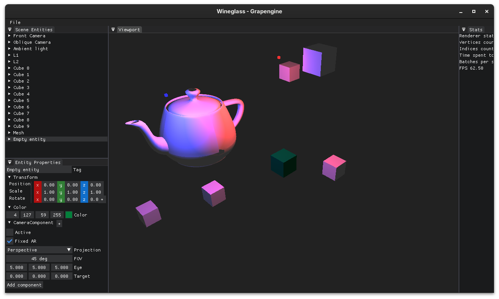

# Grapengine 🍇

A 3D Graphics Engine made with C++20 and OpenGL core profile.



### Configure

This project use `CMake`, `VCPKG` as package manager and a `CMakePresets.json` file.

The `VCPKG` is set up as git submodule.

Clone with:

```shell
## SSH
git clone --recursive git@github.com:viniciusalmada/Grapengine.git
## HTTPS
git clone --recursive https://github.com/viniciusalmada/Grapengine.git
```

There is also ImGui (https://github.com/ocornut/imgui.git) configured as submodule, it is being used to develop the
engine editor (**Wineglass 🍷**).

## Build

To build the project, only call `cmake` with the desired preset.

At this point there are 3 supported compilers and 2 differents platforms:

* For Microsoft Windows platform:
    * LLVM/Clang-cl (v16)
    * MSVC cl (2022)
* For any Linux distribution:
    * GNU GCC (v13)
    * LLVM/Clang (v16)

The list of presets are following:

* `msvc-debug`- Debug build with MSVC compiler
* `msvc-release`- Optimized build with MSVC compiler
* `clang-win-debug`- Debug build with Clang compiler as MSVC frontend
* `clang-win-release`- Optimized build with Clang compiler as MSVC frontend
* `clang-linux-debug`- Debug build with Clang compiler as GCC frontend
* `clang-linux-release`- Optimized build with Clang compiler as GCC frontend
* `gcc-debug`- Debug build with GCC compiler
* `gcc-release`- Optmized build with GCC compiler

Just call `cmake --preset <preset-name>`, this will create a folder `build-<preset-name>` with the necessary files to
compile the project.
After this, to build, call `cmake --build build-<preset-name>`.

### Structure

The project is organized by its root `CMakeLists.txt` file, essentially there are 3 targets in it:

* **Grapengine**: The library itself
* **Wine**: The engine editor
* **Tests**: The library unit tests with gtest framework